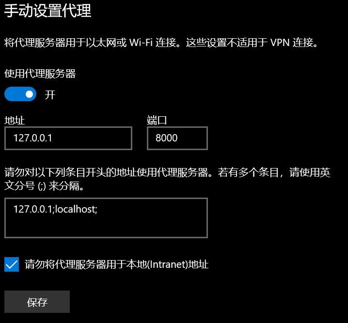
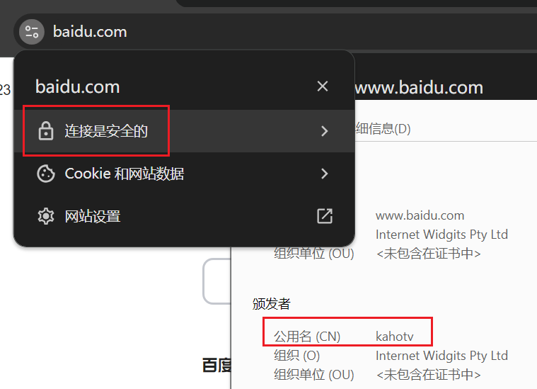

## C# Version

https://github.com/kahotv/HttpsProxyCSahrp

## Build CPP

vs2022 c++ latest

使用了asio和openssl库，需要用vcpkg安装。

```
vcpkg install asio:x86-windows-static
vcpkg install openssl[tools]:x86-windows-static
```

## Transer

- SimpleTranser

  - 简单的转发数据包

- WebSocketTranser

  - 解析WebSocket协议

    ```bash
    WSRequest : 00 06 02 00 07 7E 08 00
    WSResponse: 00 0F 7E 01 01 02 00 08 00 10 E0 F2 F1 B8 06 08 00
    WSRequest : 00 06 02 00 0A 7B 08 00
    WSResponse: 00 0F AC 01 01 02 00 08 00 10 EF F2 F1 B8 06 08 00
    ```

    详见

    ```c++
    void TransWebsocketData(const std::string& host, IN OUT std::string& data, bool up)
    {
    	const char* dir = up ? "WSRequest :" : "WSResponse:";
    	printf("%s %s\n", dir, Utils::Bin2Hex(data.data(), data.length()," ").c_str());
    }
    ```

    

# Use

需要预先准备好ca.crt、ca.key和server.key，都是PEM结构。

1. 安装`ca.crt`到"**受信任的根证书颁发机构**"
2. 设置系统代理



3. 效果




## Cert

1. 生成`ca.key`

   ```bash
   openssl.exe genrsa -out ca.key 2048
   ```

2. 生成`ca.crt`

   ```bash
   openssl.exe req -new -x509 -days 36500 -key ca.key -out ca.crt
   ```

   ```
   Country Name (2 letter code) [AU]:CN
   State or Province Name (full name) [Some-State]:AA
   Locality Name (eg, city) []:BB
   Organization Name (eg, company) [Internet Widgits Pty Ltd]:
   Organizational Unit Name (eg, section) []:
   Common Name (e.g. server FQDN or YOUR name) []:kahotv
   Email Address []:
   ```

3. 生成`server.key`

   ```bash
   openssl.exe genrsa -out server.key 2048
   ```
